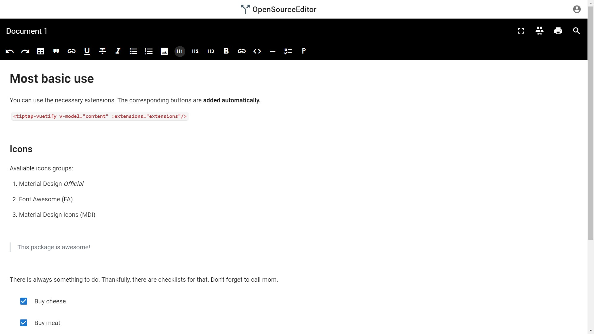

# Google Docs Clone 📝

[](LICENSE)


This is Google Docs Clone built tp demonstrate use of _Vue_ as the front end framework and _Socketio_ for Real Time Collabration on documents.Dedicated to all Web Developers with ❤️.

## About

It uses the tiptap-vuetify to render the editor and socketio for Real Time collabration. MongoDB is used as the database and Mongoose for modelling the documents.For all the requests and stae management Vuex is used.

- Clean and Simple Material UI.
- It supports dark theme too 🌗.

## Built With 🛠

- [Vue.js](https://vuejs.org/) - A progressive framework for building user interfaces.
- [Vuex](https://vuex.vuejs.org/) - Vuex is a state management pattern + library for Vue.js applications...
- [Vue Router](https://router.vuejs.org/) - The official Router for Vue.js. It deeply integrates with Vue.js core to make building Single Page Applications with Vue.js a breeze.
- [Socket IO](https://socket.io/) - SocketIO enables real-time, bidirectional and event-based communication.
  - [Events](https://socket.io/docs/#Sending-and-receiving-events) - Socket IO allows you to emit and receive custom events.
  - [Rooms and Namespaces](https://socket.io/docs/rooms-and-namespaces/) - This is a useful feature to send notifications to a group of users, or to a given user connected on several devices for example.
- [MongoDB](https://www.mongodb.com/) - MongoDB is a document database, which means it stores data in JSON-like documents.
- [Mongoose](https://mongoosejs.com/) - Elegant MongoDB object modeling for node.js
- [Morgan](https://github.com/expressjs/morgan#readme) HTTP request logger middleware for node.js
- [Cors](https://github.com/expressjs/cors#readme) - CORS is a node.js package for providing a Connect/Express middleware that can be used to enable CORS with various options.
- [Vuetify](https://vuetifyjs.com/en/) - Vuetify is a Vue UI Library with beautifully handcrafted Material Components.
- [tiptap-vuetify](https://github.com/iliyaZelenko/tiptap-vuetify) - Component simplifies integration tiptap editor with vuetify

# Frontend Structure

    client    # Root Folder
    .
    ├── node_modules       # Contains all the dependencies of the project
    ├── public             # Contains the index.html
    ├── src                # source of the frontend
    │   ├── assets         # All of the assests are stored here
    │   ├── components               # Contains all the components used in the project
              ├── EditorFile.vue     # tiptap-vuetify is rendered here
    │   ├── router         # Contains all the components used in the project
    │   ├── store          # Folder for the Vuex.State is managed through here
    │   ├── views          # Contains all the views
    │   ├── App.vue        # Contains the Editor Component and the toolbar
    │   ├── first.vue      # Document is named and saved from here
    │   ├── home.vue       # contains the <router-view>
    │   ├── main.js        # main javascript file for the frontend

# Backend Structure

    server    # Root Folder
    .
    ├── node_modules       # Contains all the dependencies of the project
    ├── models             # consist of pages which are rendered to the user when requests
    ├── controllers        # Renders the appropriate view with the model data as a response.
    ├── routes             # Enable us to define URL pattern that maps to the request handler.
    ├── index.js           # main javascript file for the backend

## Architecture

The backend of this web app uses [**_MVC (Model View Controller)_**](https://www.geeksforgeeks.org/model-view-controllermvc-architecture-for-node-applications/) architecture.


## Contribute

If you want to contribute to this library, you're always welcome!

## Contact

If you need any help or need to give me some advice, you can connect with me.

Visit:- [Vedant Mamgain](https://www.linkedin.com/in/vedant-mamgain/)

## License

```
MIT License

Copyright (c) 2020 Vedant Mamgain

Permission is hereby granted, free of charge, to any person obtaining a copy
of this software and associated documentation files (the "Software"), to deal
in the Software without restriction, including without limitation the rights
to use, copy, modify, merge, publish, distribute, sublicense, and/or sell
copies of the Software, and to permit persons to whom the Software is
furnished to do so, subject to the following conditions:

The above copyright notice and this permission notice shall be included in all
copies or substantial portions of the Software.

THE SOFTWARE IS PROVIDED "AS IS", WITHOUT WARRANTY OF ANY KIND, EXPRESS OR
IMPLIED, INCLUDING BUT NOT LIMITED TO THE WARRANTIES OF MERCHANTABILITY,
FITNESS FOR A PARTICULAR PURPOSE AND NONINFRINGEMENT. IN NO EVENT SHALL THE
AUTHORS OR COPYRIGHT HOLDERS BE LIABLE FOR ANY CLAIM, DAMAGES OR OTHER
LIABILITY, WHETHER IN AN ACTION OF CONTRACT, TORT OR OTHERWISE, ARISING FROM,
OUT OF OR IN CONNECTION WITH THE SOFTWARE OR THE USE OR OTHER DEALINGS IN THE
SOFTWARE.
```
